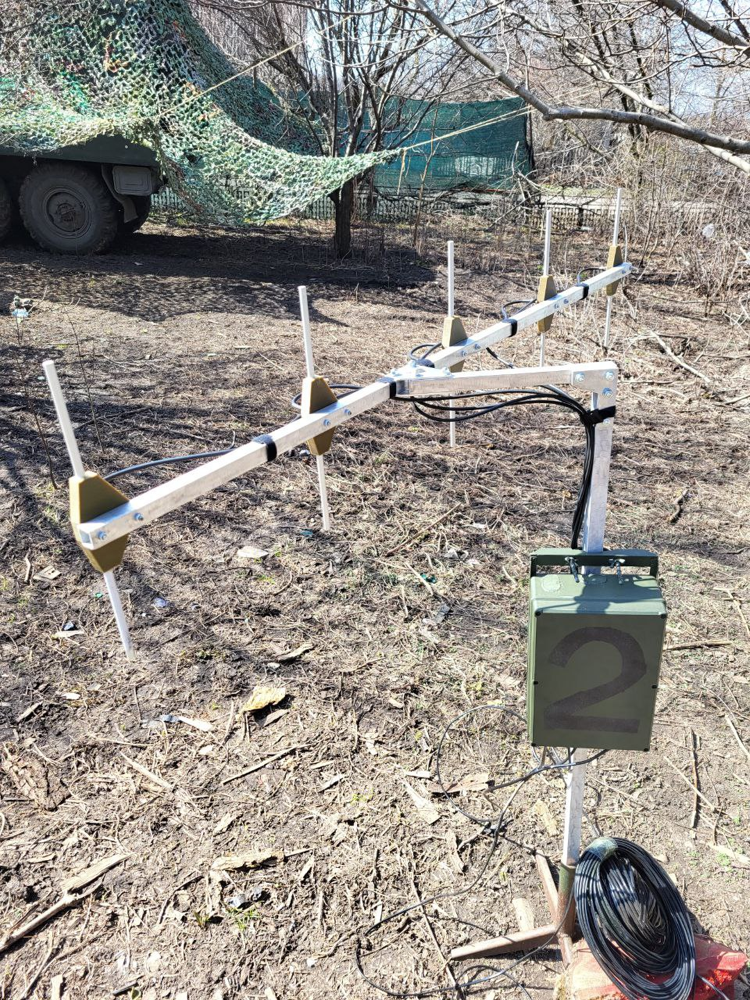
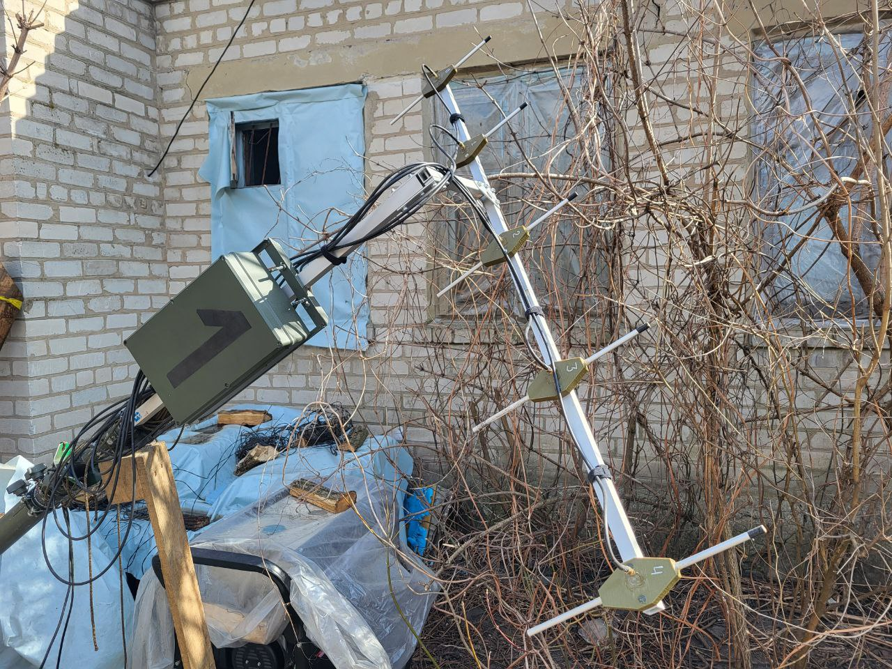
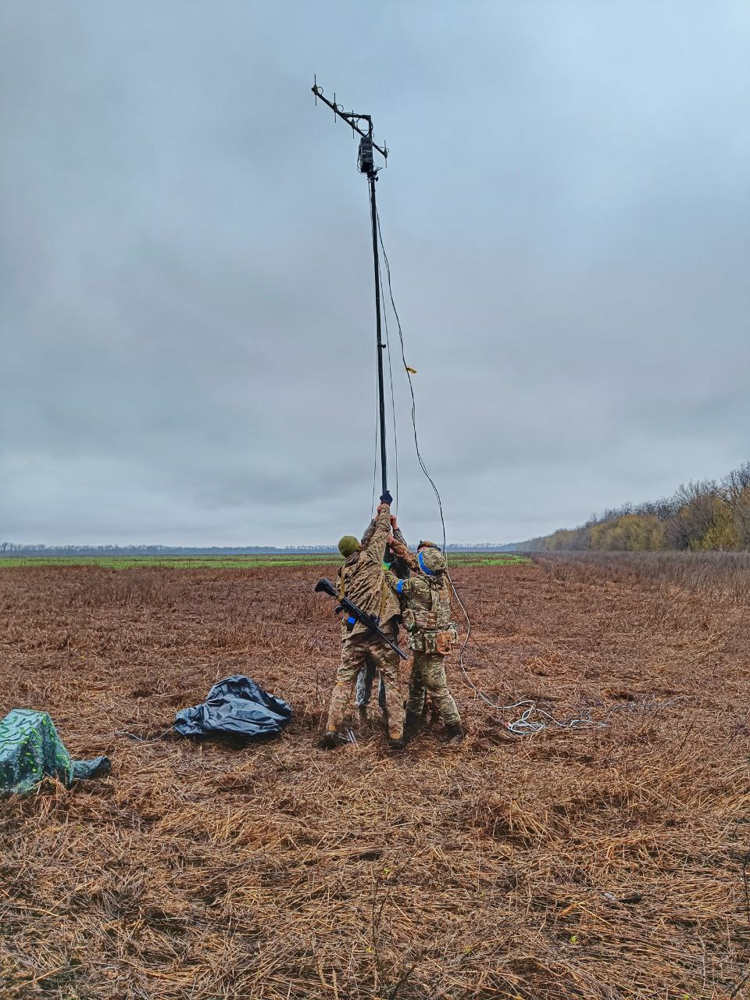
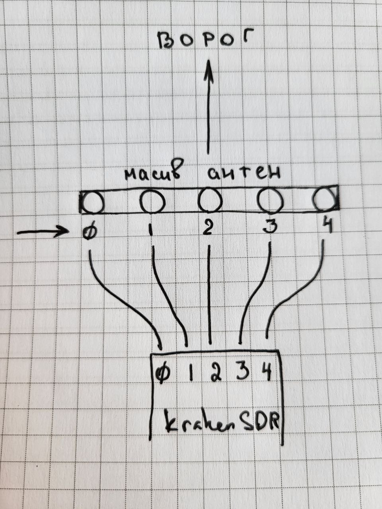

# Комплект для використання KrakenSDR в польових умовах

Конструкція розроблялась в напівпольових умовах при відсутності нормальної майстерні, задля того щоб перевірити працездатність ідеї використання KrakenSDR для військових потреб, в тому числі задля перевірки точності. Через це конструкція має дещо кустарний вигляд (термоклей, ізолента тощо), але при цьому її легко відтворити маючи прямі руки і мінімум інструментів. При цьому все ще лишається великий простір для вдосконалення, наприклад непогано було б прикрутити герметичний Ethernet та силовий роз'єми до корпусу замість нерозборного варіанту з кабелями як зараз.

Комплект умовно ділиться на компоненти:
- <a href="/dipoles">Диполі (5+2) та фідерні лінії</a>
- <a href="/linear_array">Траверса та кріплення до мачти</a>
- <a href="/box">Гермобокс</a>

## Що можна покращити

- додати герметичні роз'єми для Ethernet та живлення (силовий роз'єм) на корпус, щоб кабелі легко було замінити
- примусове охолодження гермобокса. Самий простий варіант - кулер + терморезистор. Але це потрібно лише влітку, в інші пори року бокс має бути герметичним, тобто потрібна можливість закривати та відкривати воздухозаборники
- виніс траверси від мачти можна зробити на 50 мм далі
- потрібен режим енергозбереження. Простий варіант - реле, котре відключає подачу 220в на блок живлення KrakenSDR, управляється з пінів Raspberry
- передачу даних від Raspberry до клієнта можна зробити через модулі LoRa або Motorola+Bluetooth, тобто потрібен окремий пристрій, але він суттєво здешевить конструкцію (не потрібен буде Starlink)

## Галерея

### Зауваження:

- Діполі на траверсі нумеруються зліва направо (від 0 до 4) якщо антена умовно стоїть перед вами і повернута до ворога

- Лінійний масив антен має парусність і крутиться за вітром - зробіть так щоб мачта не оберталась, бо траверса працює як флюгер
- Це додаткова причина частіше калібруватись (вираховувати кут антени до справжньої півночі), бо за ніч антена цілком може провернутись на 1-2 градуси
- Всі перешкоди між антеною та джерелом сигналу (будинки, дерева, рельєф) зменшують точність пеленгації
