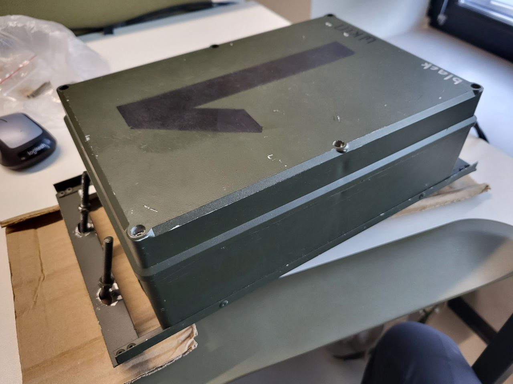
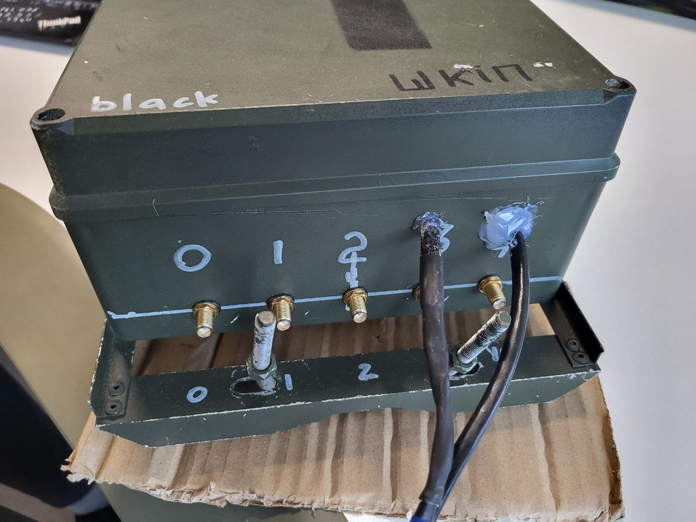
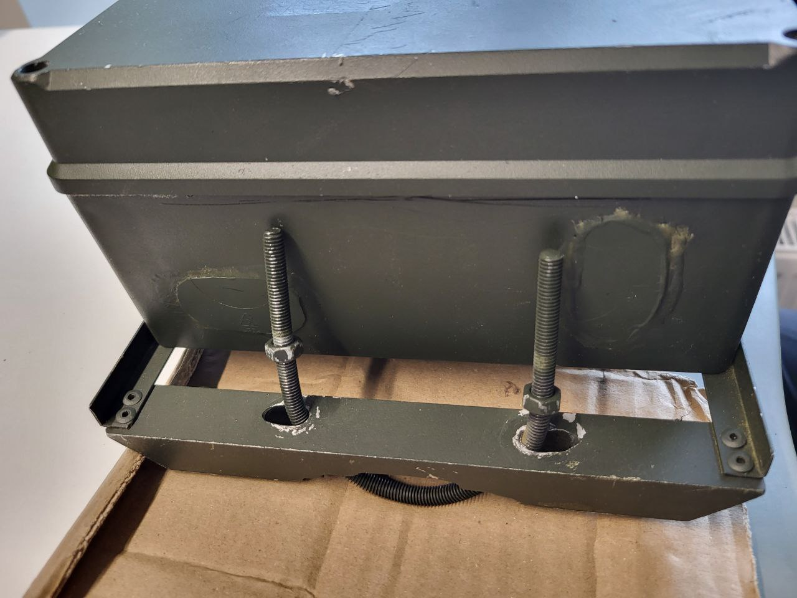
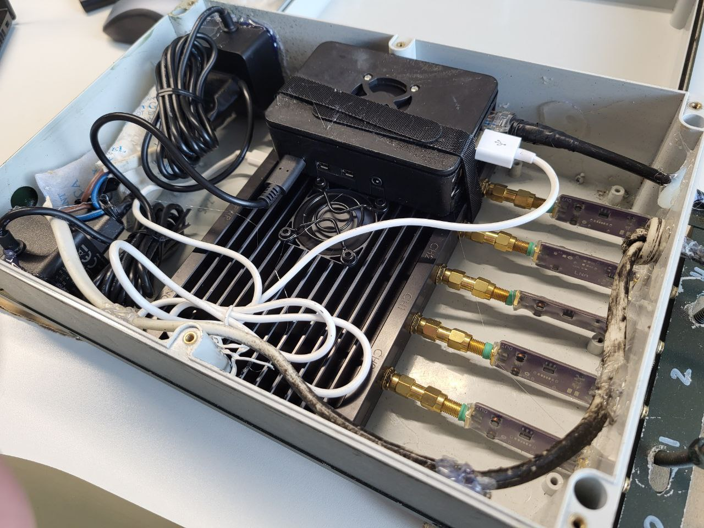
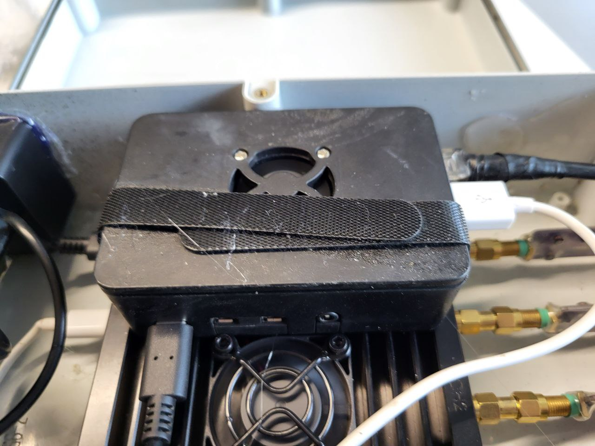
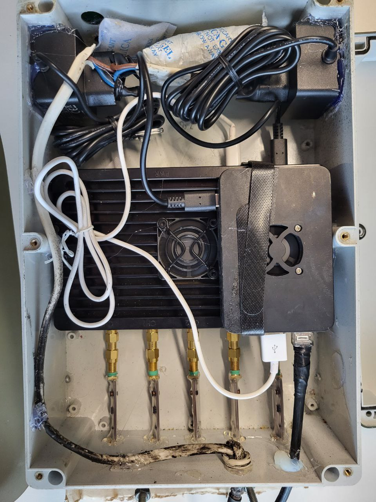
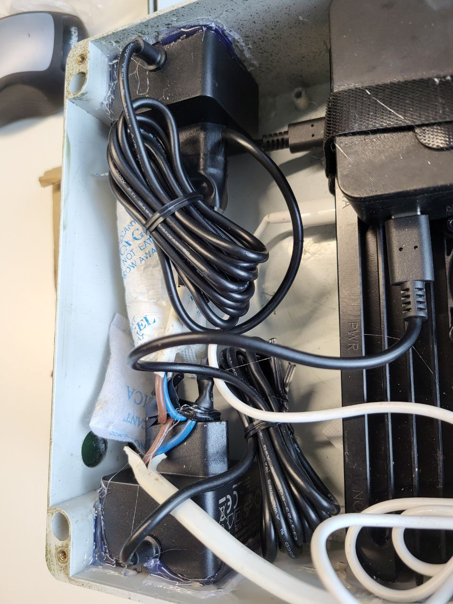
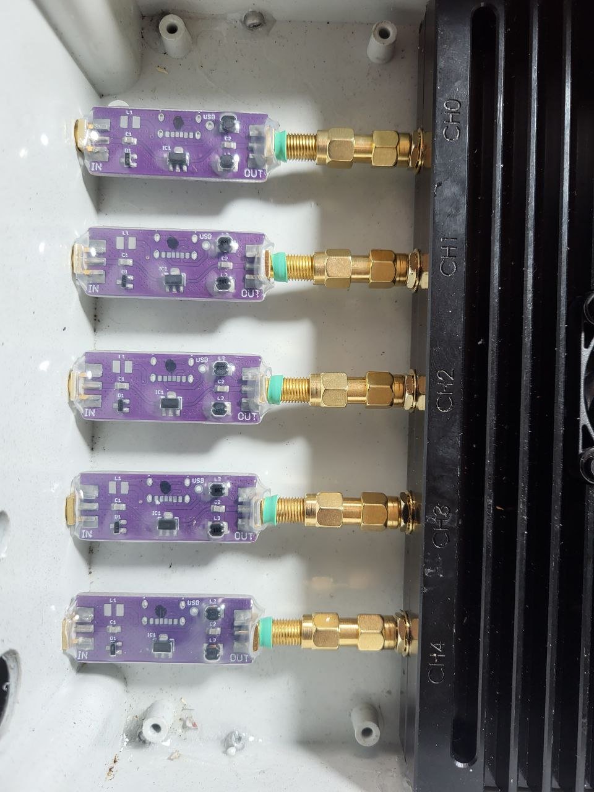
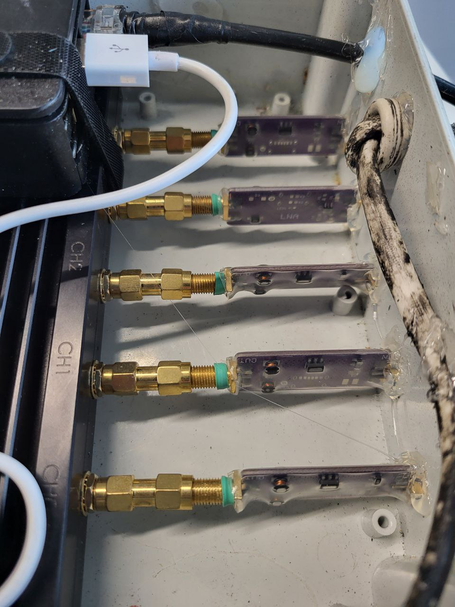

# Гермобокс

Загерметизуйте всі отвори під кабелі, роз'єми і т.д.

## Галерея

## Компоненти

### Блок живлення (потрібно 2 шт)
**Увага!** Беріть тільки оригінальний блок живлення Raspberry Pi 4. З іншими, навіть з достатньою потужністю, можна стикнутись з падінням напруги коли KrakenSDR включається та коли міняє частоту, це призводить до зависання та пошкодження файлової системи, доведеться ставити ОС заново
- https://evo.net.ua/ru/raspberry-pi-4-model-b-official-psu-black/

### Гермобокс
Вимагає допрацювання напильником щоб KrakenSDR став поперек корпусу, а також для кріплення до мачти (див. фото). Не забудьте загерметизувати всі отвори. Перед фарбуванням пройдіться ретельно наждаком по корпусу щоб покращити адгезію, інакше вся фарба швидко облізе. Якщо є пара пакетиків сілікагелю, то можете покласти всередину.
- https://www.rcscomponents.kiev.ua/product/z95jh-abs-kradex-korpus-svitlo-sirij-95x190x280mm-komplekt_131092.html

### LNA
Потрібно 5 штук як цей (можна без корпусу), краще на чипу Gali-39, він має давати нижчий фазовий шум. Живлення по BIAS-T, подача живлення вмикається на сторінці налаштувань KrakenSDR. Також в цього продавця ви можете замовити комплект із 5 фазово-симетричних кабелів для KrakenSDR із RG58 на заміну стандартних, просто акцентуйте увагу що потрібна фазова симетрія
- https://www.olx.ua/d/uk/obyavlenie/maloshumniy-pdsilyuvach-mshp-lna-0-7000-mgts-gali-39-IDRrIk7.html

### Перехідник від KrakenSDR до LNA
Потрібно 5 штук (не економте бо дешеві криві-косі, з недорізаною різьбою)
- https://kiev.prom.ua/ua/p1510478645-perehodnik-sma-vilka.html

### Кабель живлення у гермобокс 220 вольт 0.5мм^2 
Потрібно десь 30-35 метрів
- https://epicentrk.ua/ua/shop/provod-mnogozhilnyy-expert-power-shvvp-2x0-5-chernyy.html

### Патч-корд Ethernet 
35 метрів, можна 30
- https://rozetka.com.ua/powerplant_ca912643/p275820003/

### Грунт для пластику (опціонально)
- https://epicentrk.ua/ua/shop/mplc-grunt-dlya-plastiku-belife-primer-plastic-400-ml-chornii-ral9005-1ece0c1f-b65b-6742-bf34-dbc76f3f442f.html

### Фарба
RAL 6006 мат Олива
- https://epicentrk.ua/ua/shop/emal-universalnaya-ral-6006-new-ton-khaki-olivkovyy-glyanets-400-ml.html

