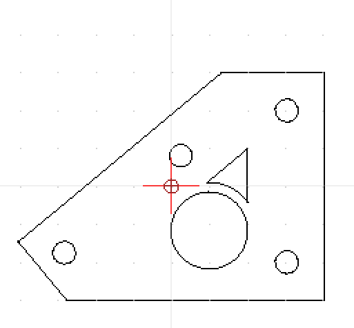
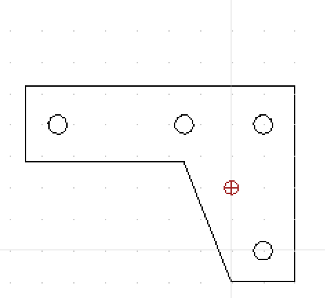
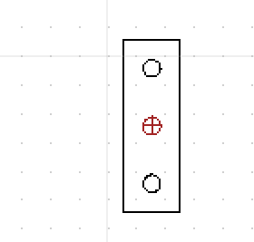
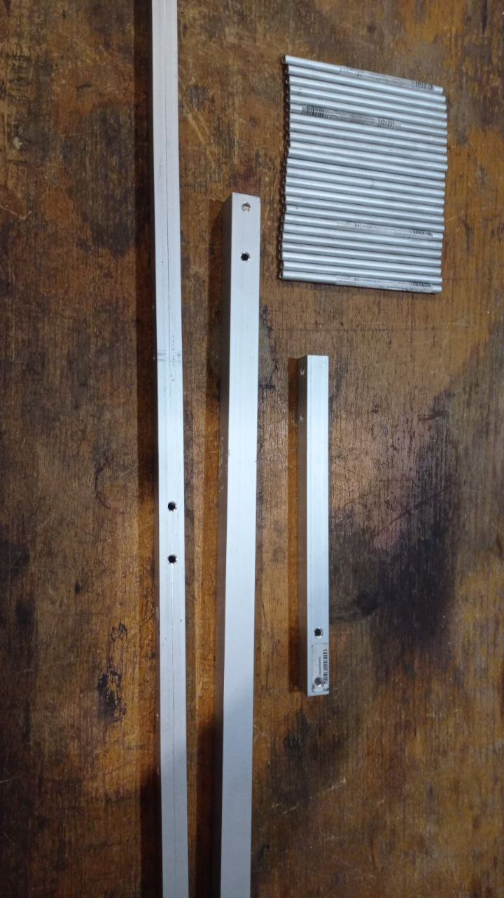
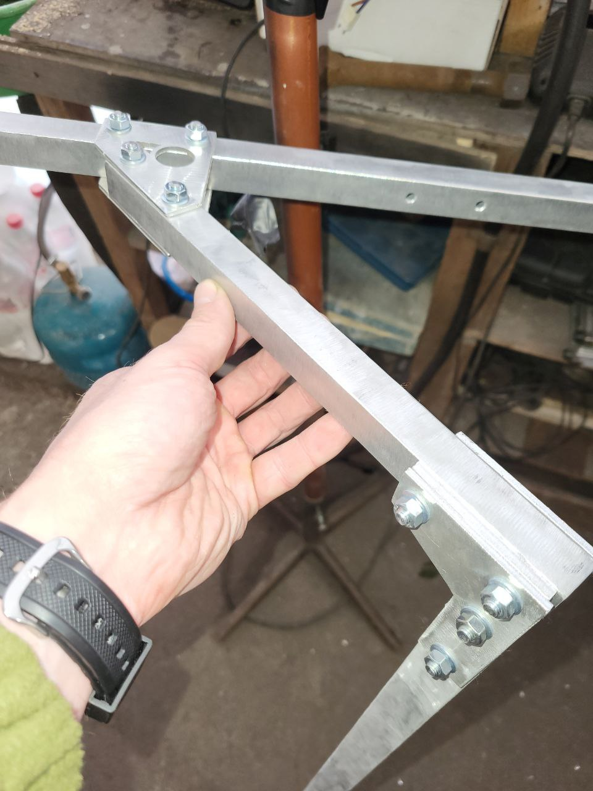

# Траверса та кронштейн (кріплення) до мачти

Кронштейн із траверсою, а саме виготовлення труб (деталі 1-3), вимагає слюсарних робіт. Виготовлення з'єднань між трубами (деталі 4-6) робиться лазерною порізкою (простіше за все), або також слюсарно

**Увага**. Дотрумуйтесь вказаних допусків при виготовленні траверси!

Листові елементи (з'єднання між трубами, деталі 4-5) виготовляються з листового алюмінію товщиною 3 мм. Деталь 6 (дистанційна вставка для переходу між трубою 25х25 та 20х20) виготовляється з листового алюмінію товщиною 5 мм

Всі елементи конструкції шліфуються для покращення адгезії (бо інакше фарба облізе миттєво), потім знежирюються, грунтуються (бажано) і фарбуються. Будете шліфувати - вдягніть респіратор, від болгарки палений цинк летить і він не дуже корисний для здоров'я якщо їм дихати.

Майте на увазі, що труби довше 1м Нова Пошта відправляє тільки на вантажні відділення.

## Траверса
<a href="траверса_short.dxf" target="_blank">Скачати креслення DXF</a>

## Виніс траверси
<a href="виніс.dxf" target="_blank">Скачати креслення DXF</a>

## Мачта
<a href="мачта.dxf" target="_blank">Скачати креслення DXF</a>

## Кріплення елементів між собою (лазерна порізка)
<a href="лазерна_порізка.zip" target="_blank">Скачати креслення під порізку лазером (DXF)</a>

## Галерея

## Де можна придбати елементи конструкції:

- ### Труба для траверси та виносу (деталі 1 та 2), 2м:
https://epicentrk.ua/ua/shop/truba-profilnaya-pryamougolnaya-alyuminiy-anodirovanoe-serebro-2-m-20x20x2x2000mm.html
https://epicentrk.ua/ua/shop/truba-profilnaya-kvadratnaya-alyuminiy-pas-2062-as-20x20x2x2000mm.html

- ### Труба для мачти (деталь 3), 1м:
https://epicentrk.ua/ua/shop/truba-profilnaya-kvadratnaya-alyuminiy-pas-2033-as-25x25x2x1000mm.html
https://epicentrk.ua/ua/shop/truba-profilnaya-pryamougolnaya-alyuminiy-anodirovanoe-serebro-1-m-25x25x1x1000mm.html

- ### Заглушка у трубу 20х20:
https://epicentrk.ua/ua/shop/zaglushka-vnutrennyaya-20kh20-pd.html

- ### Заглушка у трубу 25х25:
https://epicentrk.ua/ua/shop/zaglushka-kvadratnaya-chernaya-25kh25-mm-4-sht.html

- ### Болт М6х35 (4 шт)
https://epicentrk.ua/ua/shop/bolt-metricheskiy-din-933-6x35-mm-ves-expert-fix-85641.html

- ### Болт М6х40 (4 шт)
Можете купити саме ці що довші замість М6х35, потім по місцю вкоротити (зайвий метал близько до антен краще прибирати). Якщо вкоротите, зніміть фаску й оновіть різьбу, в полях або на морозі гайка має накручуватись швидко та без зусиль

https://epicentrk.ua/ua/shop/bolt-metricheskiy-din-933-6x40-mm-ves-expert-fix-85642.html

- ### Гайка М6
https://epicentrk.ua/ua/shop/gayka-shestigrannaya-m6-40-sht-expert-fix.html

- ### Шайба М6
https://epicentrk.ua/ua/shop/shayba-ploskaya-m6-40-sht-expert-fix.html

- ### Фарба 
RAL6006 мат, класіка

https://epicentrk.ua/ua/shop/emal-universalnaya-ral-6006-new-ton-khaki-olivkovyy-glyanets-400-ml.html